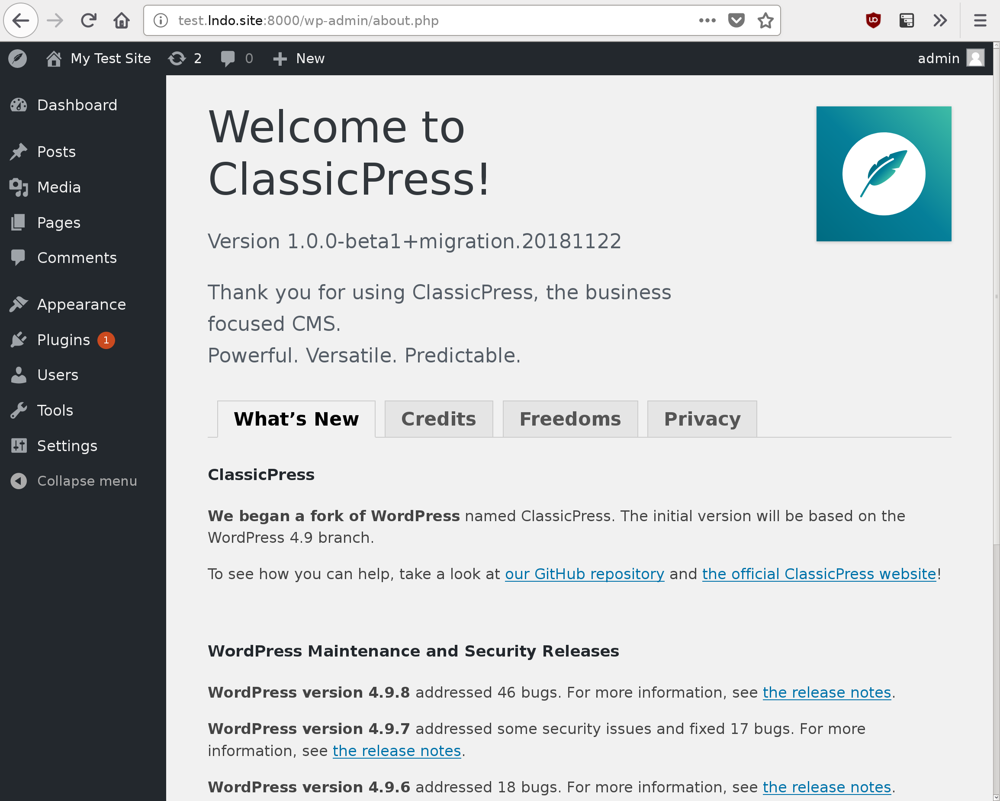

# Upgrade to ClassicPress

This is a WordPress plugin that upgrades a WordPress installation to
[ClassicPress](https://www.classicpress.net).

ClassicPress is for businesses seeking a powerful and versatile solution for
their website needs. Built on the firm foundation of WordPress 4.9.x,
ClassicPress takes your website to the next level with the same features and
functionality that you enjoyed with WordPress, but with more attention to the
most common needs of a business website.

ClassicPress is compatible with all plugins and themes that work in WordPress
`4.9.x`, so upgrading is easy.

**PLEASE NOTE:** As ClassicPress is currently in the beta release stage, we do
not recommend that you upgrade a live production site to ClassicPress.

## Installation

To **install a fresh version of ClassicPress on a new site**, you do not need
this plugin.  See our
[installation instructions](https://docs.classicpress.net/installing-classicpress/)
instead.

To **install ClassicPress on a current WordPress site** (upgrade a current
WordPress site to ClassicPress):

1. Back up the current site files and database. You can do a manual backup in
   your hosting panel and export the database, or you can use a backup plugin.
2. Download this plugin from the
   [Releases page](https://github.com/ClassicPress/ClassicPress-Migration-Plugin/releases)
   here on GitHub.
3. Install the downloaded zip file from within the WordPress dashboard
   ("Plugins" -> "Add New" -> "Upload Plugin").
4. Activate this plugin ("Upgrade to ClassicPress") after it is installed.
5. Go to the ClassicPress Upgrade plugin by clicking the **Upgrade** link in
   this plugin's table row, or at **Tools -> Upgrade to ClassicPress**.
6. If all the checks pass, press the **Upgrade this site to ClassicPress now!**
   button. If not, you'll probably need to upgrade WordPress or PHP.
7. The upgrade process may take a few minutes depending on your hosting
   provider, so go grab some water or a beverage of your choice 🙂
8. When the process is finished, you should see the ClassicPress About screen.
9. You may be prompted to upgrade ClassicPress immediately after switching from
   WordPress.  This is normal, and it is safe to upgrade.

If something is wrong, please let us know in
[our support forum](https://forums.classicpress.net/c/support/migration-plugin).

## Frequently Asked Questions

### Will my current plugins and themes work in ClassicPress?

If your current plugins work in WordPress 4.9.x, they will work in ClassicPress
too.  If you’re seeing something otherwise, that’s probably a bug with
ClassicPress, and we’d appreciate you reporting it on
[our support forum](https://forums.classicpress.net/c/support/)
or
[GitHub](https://github.com/ClassicPress).

### I’m a developer, will I need to learn any new language or framework to develop in ClassicPress?

Not unless you want to!  We have some exciting features planned for version 2
and beyond, but they will all be optional and fully backwards-compatible.

### I need help with something else, what should I do?

Like all of ClassicPress, our support is a volunteer effort by the community.
If you need help with something, please let us know in
[our support forum](https://forums.classicpress.net/c/support/)
or
[Slack group](https://www.classicpress.net/join-slack/).

## Screenshots

The plugin's admin page with information and the controls to start the upgrade:  

 

The plugin's admin page with an error that is blocking the upgrade:  

 

The plugin's upgrade progress page:  

 

The About ClassicPress screen that appears at the end of the upgrade:  

## Changelog

### 0.1.0

The initial public release of this plugin.  Upgrades to an early ClassicPress
alpha release.

### 0.2.0

Upgrades to ClassicPress `1.0.0-beta1` with working auto-updates.  Also
supports upgrading multisite WordPress installations to ClassicPress.
